## Hi there 👋

<!--
**LittBox/LittBox** is a ✨ _special_ ✨ repository because its `README.md` (this file) appears on your GitHub profile.

Here are some ideas to get you started:

- 🔭 I’m currently working on ...
- 🌱 I’m currently learning ...
- 👯 I’m looking to collaborate on ...
- 🤔 I’m looking for help with ...
- 💬 Ask me about ...
- 📫 How to reach me: ...
- 😄 Pronouns: ...
- ⚡ Fun fact: ...
-->

### About Me
- 🌱 I’m currently a student learning in Yunnan University.
- 📷 Passionate about photograph. 🧍‍♀️ I'm obsessed with shooting my little sister who is 20 years younger than me.
- 🎹 Piano grade 8(Amateur)
- 🎸 Learn guitar by myself.(Start at Apr 5,2025)

---

<table align="center" cellpadding="0" cellspacing="0" style="border: none !important; border-collapse: collapse !important; background: transparent !important;">
  <tr style="border: none !important;">
    <td style="border: none !important; padding: 0 !important; margin: 0 !important;">
      
    </td>
    <td style="border: none !important; padding: 0 !important; margin: 0 !important;">
      
    </td>
  </tr>
</table>

