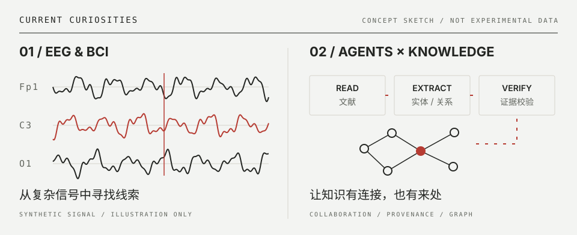
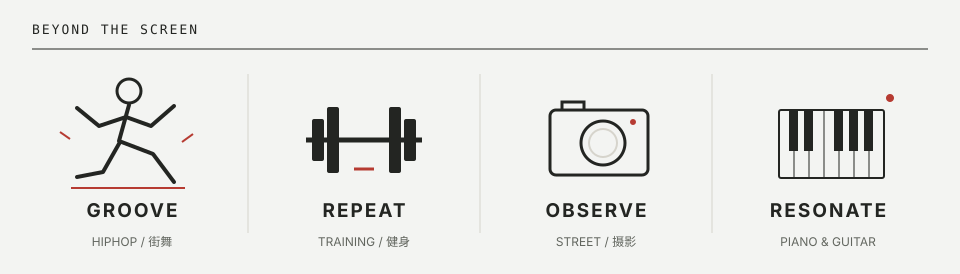
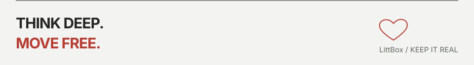

# Hi，there👋
I'm Zeng Xiangyu, student now studying in Ynu(Yunnan University)

  

  最近在研究<strong>脑机接口与 EEG 数据</strong>，以及<strong>多智能体构建知识图谱的工作流</strong>。

  业余爱好，练 hiphop 街舞，健身，拍街头，也弹钢琴和吉他。研究需要专注，生活需要律动。保持自己的节奏，对热爱的事持续投入。

  
  
  
  
  
  
  
  
  

  
  
  
  
  
  

<!-- Preserve the original counter provider and username so the existing counter is reused. -->

  
  
  
  

  <a href="#research-notes">研究手记</a> ·
  <a href="#selected-work">正在构建</a> ·
  <a href="#off-the-clock">生活切片</a> ·
  <a href="#github-in-numbers">数据记录</a> ·
  <a href="https://github.com/LittBox?tab=repositories">全部仓库 ↗</a>

 

## 01 / Research notes · 从信号到知识

**脑机接口 / EEG** 
当前关注脑电信号与数据研究，想进一步理解如何从复杂、带噪的信号中提取有意义的信息。

**多智能体 / 知识图谱** 
探索多个智能体如何协作完成知识整理与图谱构建。关心的不只是“生成了什么”，也包括知识从哪里来、关系是否可靠、过程能否追溯。

**软件工程 / 研究实现** 
把学习、原型和工具持续放进仓库，让研究想法有可以阅读、运行和迭代的实现。

这里记录当前研究兴趣与探索方向；上图是概念示意，并非已完成系统或实验结果。

 

## 02 / Selected work · 把想法写成代码

| 项目 | 我在这里做什么 |
| :--- | :--- |
| **[Neo4j Study Demo ↗](https://github.com/LittBox/Neo4j_Study_Demo)** | 基于 AI 与知识图谱数据库的医疗健康助手学习项目。沿着图数据库，学习如何组织和连接知识。 |
| **[Multi-agent Edu ↗](https://github.com/LittBox/multi_agent_edu)** | 数据库课程项目，参考 [multi-agent-education](https://github.com/bcefghj/multi-agent-education)，进行前端美化与后端数据库连接。 |
| **[AngelRare PPT ↗](https://github.com/LittBox/AngelRare-PPT)** | 探索用 Agent 生成演示文稿，把智能体能力放进具体任务。 |
| **[YNU Shooting Training ↗](https://github.com/LittBox/ynu-shooting-training)** | 云大射击训练管理微信小程序，覆盖预约、排班、签到与成绩登记。`Vue 3` `Spring Boot` `PostgreSQL` |
| **[Mathematical Modeling Toolkit ↗](https://github.com/LittBox/mathematical-modeling-toolkit)** | 整理数学建模的 Python 模板、可视化示例、方法与学术写作笔记。 |

学习项目、课程实践和持续探索都保留它们本来的样子。更多代码见 <a href="https://github.com/LittBox?tab=repositories">Repositories</a>。

 

## 03 / Off the clock · 屏幕之外

**Hiphop / 街舞新手** — 从基础律动开始，慢慢找到身体与节拍的连接。 
**Training / 健身人** — 一次训练，一次积累。进步也可以很安静。 
**Photography / 街头观察者** — 使用 Canon 和 Sony，喜欢街头纪实，留意日常里没被说完的故事。 
**Music / 继续练习** — 钢琴业余八级；从 2025 年 4 月 5 日开始自学吉他。

 

## 04 / GitHub in numbers · 数据记录

<!-- Keep quantitative profile features when changing the visual design. -->

  

  

  

Profile views 是访问次数，并非独立访客人数；语言分布反映公开仓库代码，不代表熟练度。统计卡片由第三方服务提供，更新与显示可能存在延迟。

 

  如果你也在探索 EEG、脑机接口或多智能体知识图谱，欢迎在相关仓库的 Issues 里交流。

